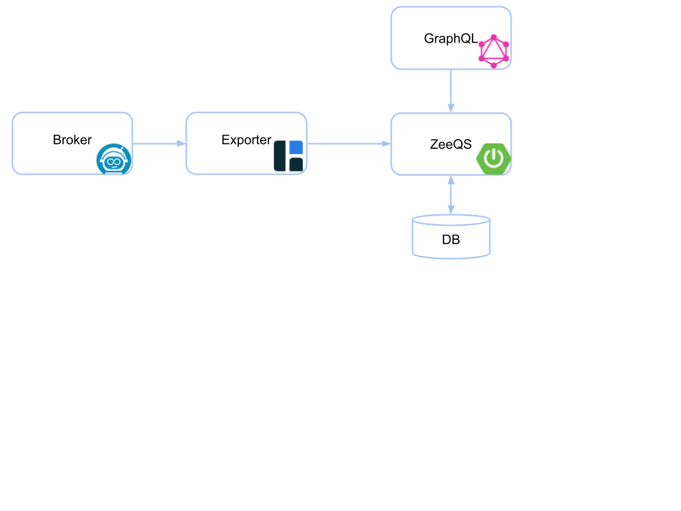

ZeeQS - Zeebe Query Service
=========================

[](https://github.com/camunda-community-hub/community)
[](https://github.com/Camunda-Community-Hub/community/blob/main/extension-lifecycle.md#stable-)
[](https://opensource.org/licenses/Apache-2.0)

[](https://github.com/camunda-community-hub/community/blob/main/extension-lifecycle.md#compatiblilty)

A [Zeebe](https://zeebe.io) community extension that provides a GraphQL query API over Zeebe's data. The data is imported from the broker using an exporter (e.g. Hazelcast, Elasticsearch) and aggregated in the service.



## Usage

The application provides an endpoint `/graphql` for GraphQL queries.

A query can be send via HTTP POST request and a JSON body containing the `query`. For example:

```
curl \
  -X POST \
  -H "Content-Type: application/json" \
  --data '{ "query": "{ processes { nodes { key } } }" }' \
  http://localhost:9000/graphql
```

While development, the graph can be explored using the integrated GraphiQL:
http://localhost:9000/graphiql

### Queries

The API provide the following queries:
* processes
* processInstances
* jobs
* messages 
* incidents
* errors
 
And additional queries to request a single object by its key (e.g. `process(key: "2251799813685249")`).

### Pagination

In order to limit the response size and the query processing, each list query uses pagination to return only a subset of the data. By default, it returns the first 10 items of the list.

In addition to the items, the query result contains also the total count of the items. 

```graphql
{
  processes(perPage: 10, page: 0) {
    totalCount
    nodes {
      key
    }
  }
}
```

### Filters

Some queries allow to filter the result by passing arguments in the query. 

```graphql
{
  processInstances(stateIn: [ACTIVATED]) {
    nodes {
      key
    }
  }
}
```

### Examples

Get processes including their process instance count: 

```graphql
{
  processes {
    totalCount
    nodes {
      key
      bpmnProcessId
      version
      processInstances {
        totalCount
      }
    }
  }
}
```

<details>
  <summary>Query Response</summary>
  <p>

```
{
  "data": {
    "processes": {
      "totalCount": 3,
      "nodes": [
        {
          "key": "2251799813685249",
          "bpmnProcessId": "demo-process",
          "version": 1,
          "processInstances": {
            "totalCount": 3
          }
        },
        {
          "key": "2251799813685251",
          "bpmnProcessId": "demo-2",
          "version": 1,
          "processInstances": {
            "totalCount": 2
          }
        },
        {
          "key": "2251799813685269",
          "bpmnProcessId": "demo-3",
          "version": 1,
          "processInstances": {
            "totalCount": 1
          }
        }
      ]
    }
  }
}
```

  </p>
</details>

Get process instances that are active including their active element instances:

```graphql
{
  processInstances(stateIn: [ACTIVATED]) {
    totalCount
    nodes {
      key
      state
      process {
        bpmnProcessId
      }
      elementInstances(stateIn: [ACTIVATED]) {
        elementId
        elementName
        bpmnElementType
        state
      }
    }
  }
}
```

<details>
  <summary>Query Response</summary>
  <p>

```
{
  "data": {
    "processInstances": {
      "totalCount": 6,
      "nodes": [
        {
          "key": "2251799813685261",
          "state": "ACTIVATED",
          "process": {
            "bpmnProcessId": "demo-process"
          },
          "elementInstances": [
            {
              "elementId": "demo-process",
              "elementName": null,
              "bpmnElementType": "PROCESS",
              "state": "ACTIVATED"
            },
            {
              "elementId": "ServiceTask_0f8l2yf",
              "elementName": "task 3",
              "bpmnElementType": "SERVICE_TASK",
              "state": "ACTIVATED"
            }
          ]
        },
        {
          "key": "2251799813685271",
          "state": "ACTIVATED",
          "process": {
            "bpmnProcessId": "demo-2"
          },
          "elementInstances": [
            {
              "elementId": "demo-2",
              "elementName": null,
              "bpmnElementType": "PROCESS",
              "state": "ACTIVATED"
            },
            {
              "elementId": "ServiceTask_0mhbd5b",
              "elementName": "task 3",
              "bpmnElementType": "SERVICE_TASK",
              "state": "ACTIVATED"
            }
          ]
        },
        {
          "key": "2251799813685277",
          "state": "ACTIVATED",
          "process": {
            "bpmnProcessId": "demo-2"
          },
          "elementInstances": [
            {
              "elementId": "demo-2",
              "elementName": null,
              "bpmnElementType": "PROCESS",
              "state": "ACTIVATED"
            },
            {
              "elementId": "ServiceTask_19bf066",
              "elementName": "task 1",
              "bpmnElementType": "SERVICE_TASK",
              "state": "ACTIVATED"
            }
          ]
        },
        {
          "key": "2251799813685287",
          "state": "ACTIVATED",
          "process": {
            "bpmnProcessId": "demo-3"
          },
          "elementInstances": [
            {
              "elementId": "demo-3",
              "elementName": null,
              "bpmnElementType": "PROCESS",
              "state": "ACTIVATED"
            },
            {
              "elementId": "ServiceTask_0t5azxx",
              "elementName": "task 2",
              "bpmnElementType": "SERVICE_TASK",
              "state": "ACTIVATED"
            }
          ]
        },
        {
          "key": "2251799813685304",
          "state": "ACTIVATED",
          "process": {
            "bpmnProcessId": "demo-process"
          },
          "elementInstances": [
            {
              "elementId": "demo-process",
              "elementName": null,
              "bpmnElementType": "PROCESS",
              "state": "ACTIVATED"
            },
            {
              "elementId": "ServiceTask_01flslu",
              "elementName": "task 2",
              "bpmnElementType": "SERVICE_TASK",
              "state": "ACTIVATED"
            }
          ]
        },
        {
          "key": "2251799813685310",
          "state": "ACTIVATED",
          "process": {
            "bpmnProcessId": "demo-process"
          },
          "elementInstances": [
            {
              "elementId": "demo-process",
              "elementName": null,
              "bpmnElementType": "PROCESS",
              "state": "ACTIVATED"
            },
            {
              "elementId": "ServiceTask_0m7fzva",
              "elementName": "task 1",
              "bpmnElementType": "SERVICE_TASK",
              "state": "ACTIVATED"
            }
          ]
        }
      ]
    }
  }
}
```

  </p>
</details>

Get jobs that are activate (i.e. not completed or canceled) and have one of the given job types:

```graphql
{
  jobs(stateIn: [ACTIVATABLE, ACTIVATED], jobTypeIn: ["task-1", "task-2", "task-3"]) {
    totalCount
    nodes {
      key
      jobType
      state
      elementInstance {
        elementId
        elementName
        processInstance {
          key
          process {
            key
            bpmnProcessId
          }
        }
      }
    }
  }
}
```

<details>
  <summary>Query Response</summary>
  <p>

```
{
  "data": {
    "jobs": {
      "totalCount": 5,
      "nodes": [
        {
          "key": "2251799813685282",
          "jobType": "task-1",
          "state": "ACTIVATABLE",
          "elementInstance": {
            "elementId": "ServiceTask_19bf066",
            "elementName": "task 1",
            "processInstance": {
              "key": "2251799813685277",
              "process": {
                "key": "2251799813685251",
                "bpmnProcessId": "demo-2"
              }
            }
          }
        },
        {
          "key": "2251799813685303",
          "jobType": "task-2",
          "state": "ACTIVATABLE",
          "elementInstance": {
            "elementId": "ServiceTask_0t5azxx",
            "elementName": "task 2",
            "processInstance": {
              "key": "2251799813685287",
              "process": {
                "key": "2251799813685269",
                "bpmnProcessId": "demo-3"
              }
            }
          }
        },
        {
          "key": "2251799813685315",
          "jobType": "task-1",
          "state": "ACTIVATABLE",
          "elementInstance": {
            "elementId": "ServiceTask_0m7fzva",
            "elementName": "task 1",
            "processInstance": {
              "key": "2251799813685310",
              "process": {
                "key": "2251799813685249",
                "bpmnProcessId": "demo-process"
              }
            }
          }
        },
        {
          "key": "2251799813685321",
          "jobType": "task-3",
          "state": "ACTIVATABLE",
          "elementInstance": {
            "elementId": "ServiceTask_0f8l2yf",
            "elementName": "task 3",
            "processInstance": {
              "key": "2251799813685261",
              "process": {
                "key": "2251799813685249",
                "bpmnProcessId": "demo-process"
              }
            }
          }
        },
        {
          "key": "2251799813685324",
          "jobType": "task-2",
          "state": "ACTIVATABLE",
          "elementInstance": {
            "elementId": "ServiceTask_01flslu",
            "elementName": "task 2",
            "processInstance": {
              "key": "2251799813685304",
              "process": {
                "key": "2251799813685249",
                "bpmnProcessId": "demo-process"
              }
            }
          }
        }
      ]
    }
  }
}
```

  </p>
</details>

Get jobs from a specific process instance

```graphql
{ 
  processInstance(key: "2251799814310503") { 
    state 
    jobs { 
      key 
      jobType 
      elementInstance { 
        elementId 
      } 
    } 
  } 
}
```

<details>
  <summary>Query Response</summary>
  <p>

```
{ 
  "data": {
    "processInstance": {
      "state": "COMPLETED",
      "jobs": [
        {
          "key": "2251799814310522",
          "jobType": "DMN",
          "elementInstance": {
            "elementId": "demo-1"
          }
        },
        {
          "key": "2251799814310525",
          "jobType": "DMN",
          "elementInstance": {
            "elementId": "demo-2"
          }
        },
        {
          "key": "2251799814310527",
          "jobType": "demo-3",
          "elementInstance": {
            "elementId": "demo-3"
          }
        }
      ]
    }
  }
}
```

  </p>
</details>

## Install

### Docker

The docker image for the ZeeQS application is published to [GitHub Packages](https://github.com/orgs/camunda-community-hub/packages/container/package/zeeqs).

```
docker pull ghcr.io/camunda-community-hub/zeeqs:2.3.1
```
 
* ensure that a Zeebe broker is running with a Hazelcast exporter (>= 1.0.0)  
* forward the Hazelcast port to the docker container (default: `5701`)
* configure the connection to Hazelcast by setting `zeebe.client.worker.hazelcast.connection` (default: `localhost:5701`) 

If the Zeebe broker runs on your local machine with the default configs then start the container with the following command:  

```
docker run --network="host" ghcr.io/camunda-community-hub/zeeqs:2.3.1
```

For a local setup, the repository contains a [docker-compose file](docker/docker-compose.yml). It starts a Zeebe broker with the Hazelcast exporter and the ZeeQS application. 

```
mvn clean install -DskipTests
cd docker
docker-compose --profile in-memory up
```

* the GraphQL endpoint is available under the port `9000`

To use PostgreSQL instead of the in-memory database, use the profile `postgres`.

```
docker-compose --profile postgres up
```

### Manual
    
1. Download the latest [application JAR](https://github.com/zeebe-io/zeeqs/releases) _(zeeqs-%{VERSION}.jar )_   

1. Start the application `java -jar zeeqs-{VERSION}.jar`

### Configuration

The application is a Spring Boot application. The configuration can be changed via environment variables or an `application.yaml` file. See also the following resources:
* [Spring Boot Configuration](https://docs.spring.io/spring-boot/docs/current/reference/html/spring-boot-features.html#boot-features-external-config)

By default, the port is set to `9000` and the database is only in-memory (i.e. not persistent).

```
zeebe:
  client:
    worker:
      hazelcast:
        connection: localhost:5701
        connectionTimeout: PT1M
        ringbuffer: zeebe
        connectionInitialBackoff: PT15S
        connectionBackoffMultiplier: 2.0
        connectionMaxBackoff: PT30S

spring:

  datasource:
    url: jdbc:h2:mem:zeeqs;DB_CLOSE_DELAY=-1
    username: sa
    password:
    driverClassName: org.h2.Driver

  jpa:
    database-platform: org.hibernate.dialect.H2Dialect
    hibernate:
      ddl-auto: create

server:
  port: 9000
```

Using a different database, for example, PostgreSQL:

* change the following database configuration settings

```
- spring.datasource.url=jdbc:postgresql://db:5432/postgres
- spring.datasource.username=postgres
- spring.datasource.password=zeebe
- spring.datasource.driverClassName=org.postgresql.Driver
- spring.jpa.properties.hibernate.dialect=org.hibernate.dialect.PostgreSQLDialect
```

<details>
  <summary>Full docker-compose.yml with PostgreSQL</summary>
  <p>

```
version: "2"

networks:
  zeebe_network:
    driver: bridge

services:
  zeebe:
    container_name: zeebe_broker
    image: camunda/zeebe:1.0.0
    environment:
      - ZEEBE_LOG_LEVEL=debug
    ports:
      - "26500:26500"
      - "9600:9600"
      - "5701:5701"
    volumes:
      - ../target/exporter/zeebe-hazelcast-exporter.jar:/usr/local/zeebe/exporters/zeebe-hazelcast-exporter.jar
      - ./application.yaml:/usr/local/zeebe/config/application.yaml
    networks:
      - zeebe_network
      
  zeeqs:
    container_name: zeeqs
    image: ghcr.io/camunda-community-hub/zeeqs:2.0.0
    environment:
      - zeebe.client.worker.hazelcast.connection=zeebe:5701
      - spring.datasource.url=jdbc:postgresql://db:5432/postgres
      - spring.datasource.username=postgres
      - spring.datasource.password=zeebe
      - spring.datasource.driverClassName=org.postgresql.Driver
      - spring.jpa.properties.hibernate.dialect=org.hibernate.dialect.PostgreSQLDialect
    ports:
      - "9000:9000"
    depends_on:
      - db
    networks:
      - zeebe_network

  db:
    image: postgres:12.2
    restart: always
    environment:
      POSTGRES_PASSWORD: zeebe
    volumes:
      - database-data:/var/lib/postgresql/data/
    networks:
      - zeebe_network

volumes:
  database-data:
```

  </p>
</details>

## Build from Source

Build with Maven

`mvn clean install`

## Code of Conduct

This project adheres to the Contributor Covenant [Code of
Conduct](/CODE_OF_CONDUCT.md). By participating, you are expected to uphold
this code. Please report unacceptable behavior to code-of-conduct@zeebe.io.

## License

[Apache License, Version 2.0](/LICENSE) 

